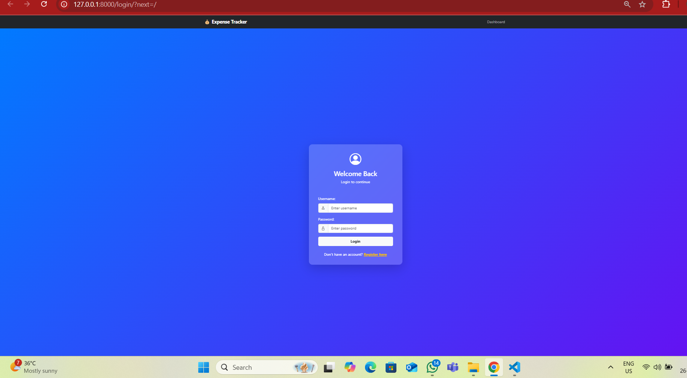

# 💸 Expense Tracker

A simple and powerful web-based expense tracker that helps users manage their daily, weekly, or monthly expenses efficiently. Users can add, edit, delete, and categorize expenses with a clean UI and visual summaries.

---

### 📖 Description

This Expense Tracker application allows users to track income and expenses, categorize transactions, and view summaries through interactive charts. Built with a focus on simplicity, usability, and data visualization to help users make smarter financial decisions.

---

### 🧠 Features

- ✅ Add, update, and delete expenses
- ✅ Categorize expenses (Food, Travel, Shopping, etc.)
- ✅ View daily/weekly/monthly summaries
- ✅ Pie chart & bar graph visualizations
- ✅ Mobile-friendly responsive design
- ✅ Lightweight and fast

---

### 🛠️ Tech Stack

- **Frontend:** HTML, CSS, JavaScript, Bootstrap
- **Backend:** Python, Django
- **Database:** SQLite / MySQL
- **Charts:** Chart.js

---

### 📸 Screenshots

#### 🧾 Login Page


#### 📊 Dashboard


#### 💼 Expense Entry


#### 📄 Downloadable Report (PDF)


---

### 🚀 How to Run Locally

```bash
# Clone the repo
git clone https://github.com/your-username/expense-tracker.git

# Navigate into the project folder
cd expense-tracker

# Install dependencies (if using Flask)
pip install -r requirements.txt

# Run the app
python app.py
